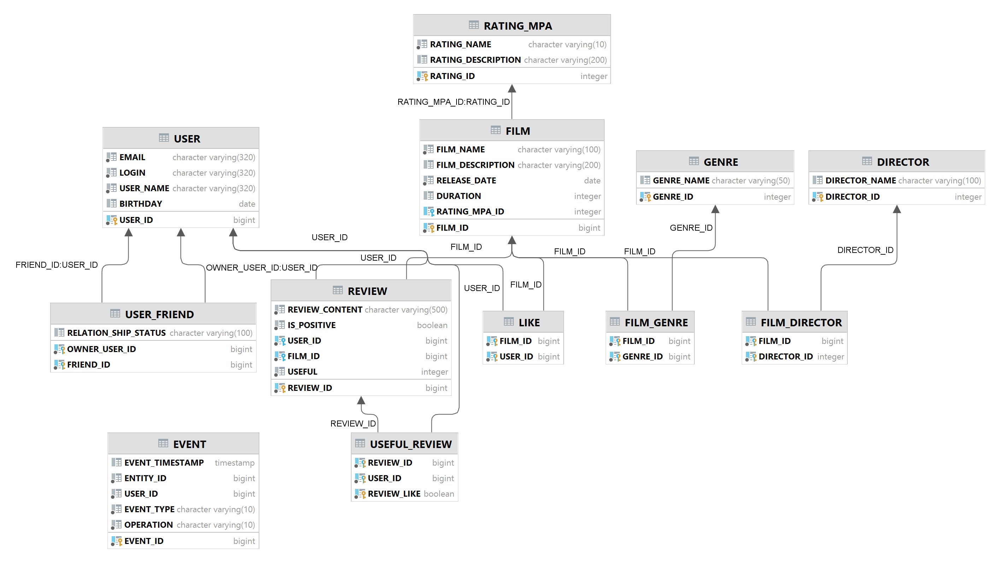

#  Filmorate

---
### Бэкенд для сервиса работы с фильмами и оценками пользователей

#### Приложение умеет посредством Rest API:

* Добавлять, обновлять, удалять, получать фильмы
* Добавлять, обновлять, удалять, получать пользователей
* Дает возможность пользователям:
    * добавлять друг-друга в друзья
    * ставить лайки фильмам
    * смотреть список общих друзей
    * получать рекомендации по фильмам для просмотра
    * находить общие с друзьями фильмы
    * получать список популярных фильмов
    * Добавлять, удалять, обновлять и получать отзывы к фильмам
    * Просматривать ленты последних событий на платформе
    * Искать фильмы по ключевым словам

#### Приложение написано на Java
Реализация использует:

* SpringBoot
* Работа на Базе Данных H2
* Unit-Тесты

## ER-диаграмма модели БД

